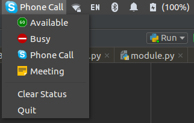

# slack-status

PyGTK application for easy Slack status switching via your notification area.

Designed for and tested on Ubuntu 14.04 LTS with Unity.  Probably works with other GTK 3 desktop environments, but I really have no idea.

## Screenshot

## Requirements

 - Python 3
 - `slackclient`
 - Whatever package `gi.repository` comes from
 
## Usage

 1. Clone this repository
 2. [Create a new Slack app](https://api.slack.com/apps?new_app=1)
    - Add the `emoji:read` and `users.profile:write` scopes
    - Jot down the OAuth token for the next step
 3. Copy `config.json.example` to `config.json` and edit the following:
    - Change `slack_token` to contain your OAuth token
    - Add/edit/remove the `statuses` to suit your needs. The `text` and `emoji` keys **must** be present; `text` can be an empty string.
 4. Run `app.py`!

## Limitations

 - This only supports a single Slack workspace
 - Status changes made in Slack will not update here
 - Slack's default emojis can be used in your `config.json` but won't appear in the menu
 - Animated GIFs won't appear in the menu - this is likely a limitation of GTK 